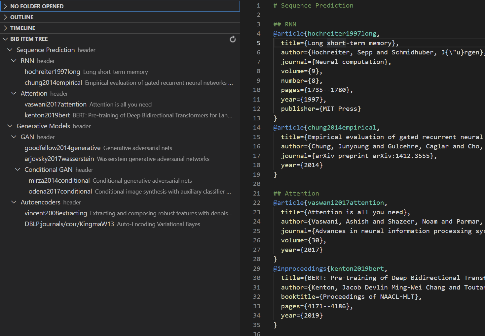
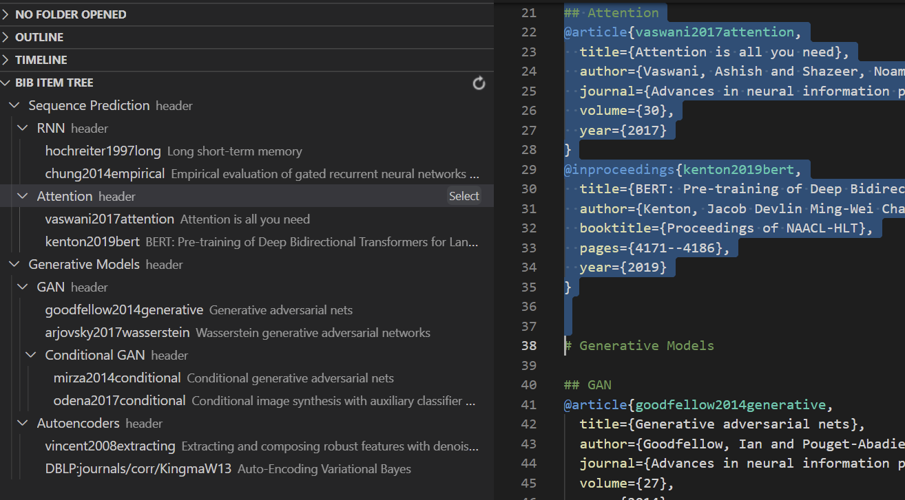

# Bibtex Helper for VSCODE

A simple management toll for bibtex files.
Source code: https://github.com/zfscgy/bibtex-helper

## Features
The extension displays a Bib Item Tree on the left.
*   Markdown-style headers (e.g., `### header3`) can be used to classify different bibtex entries.
    
*   Right-click on the item on the Bib Item Tree will navigate to the position of the entry/header.
*   `Copy` and `Select` button for bibtex entries and headers.
    *   Click `Copy`, the label of the bibtex entry will be copied.
    *   Click `Select`, the block defined by the header will be selected.

    

## Release Notes
### 0.0.1